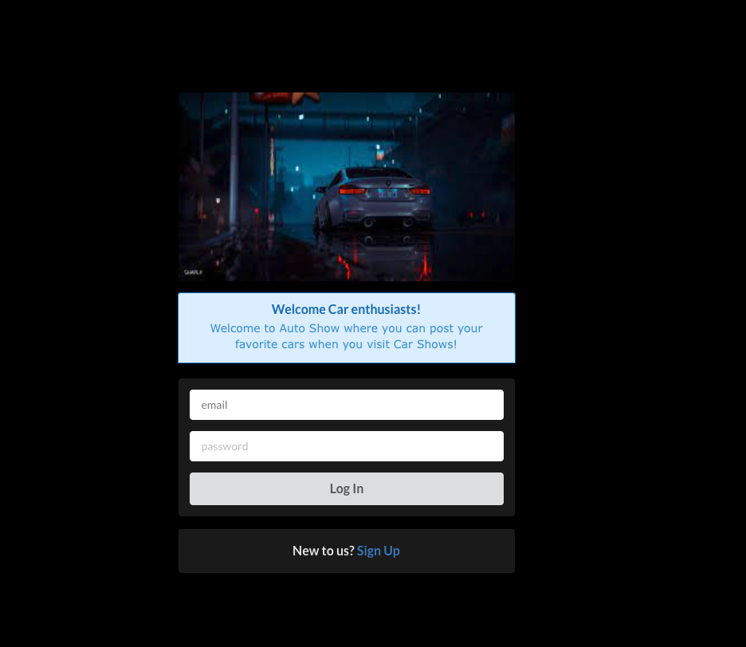
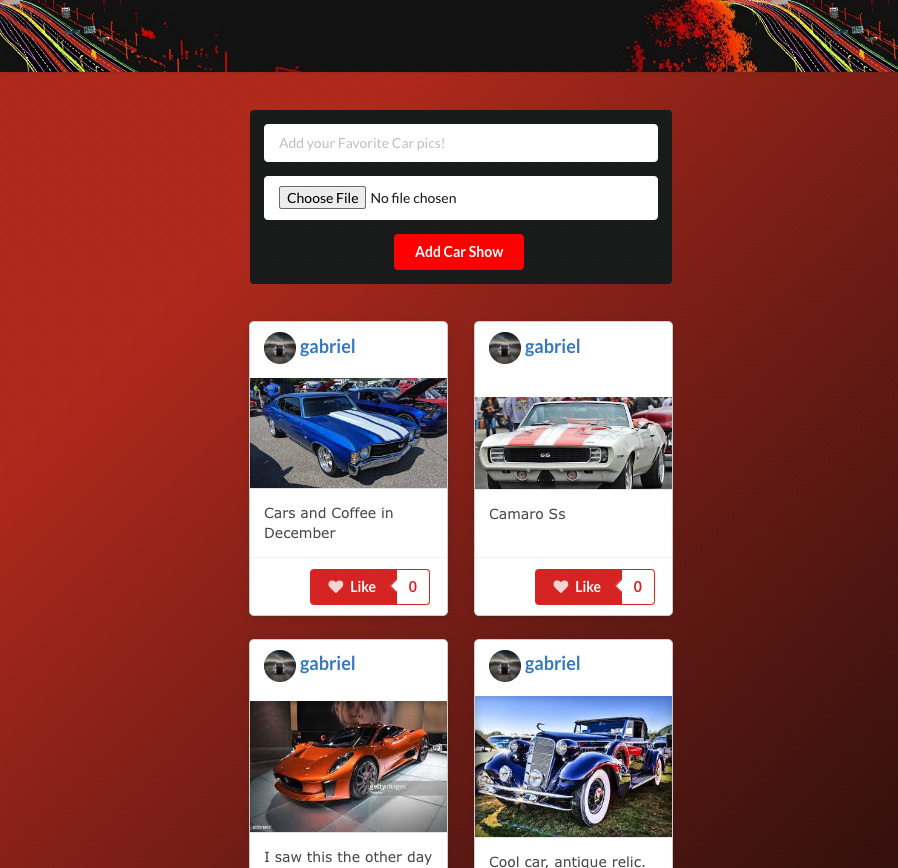

# Auto Show:

### Post your favorite Car here and view other car shows!

This application is meant as an enthusiast tool for people who love going to car shows. 

This full-stack MERN application uses react, node, and JWT tokens to provide a seemless user experience. Allowing you to sign up, post, like, and view Car Enthusiasts profile. 

- Auto Show App: https://autoshows.herokuapp.com/

#### Technologies used:
> React
>
> NodeJS
>
> Express
>
> MongoDB/Mongoose
>
> JWT Web Token 
>
> Javascript
>
> Semantic UI
>
> AWS
>
> CSS
>

### Getting Started:
-  https://autoshows.herokuapp.com/
- Trello: https://trello.com/b/fK0HmvWj/car-show-forumname-in-progress
#### Planned Next Steps:
- A user can dislike posts.
- A user can edit and delete posts. 
- Add an API for Car Shows in your local area.
- Comment section under posts. 
